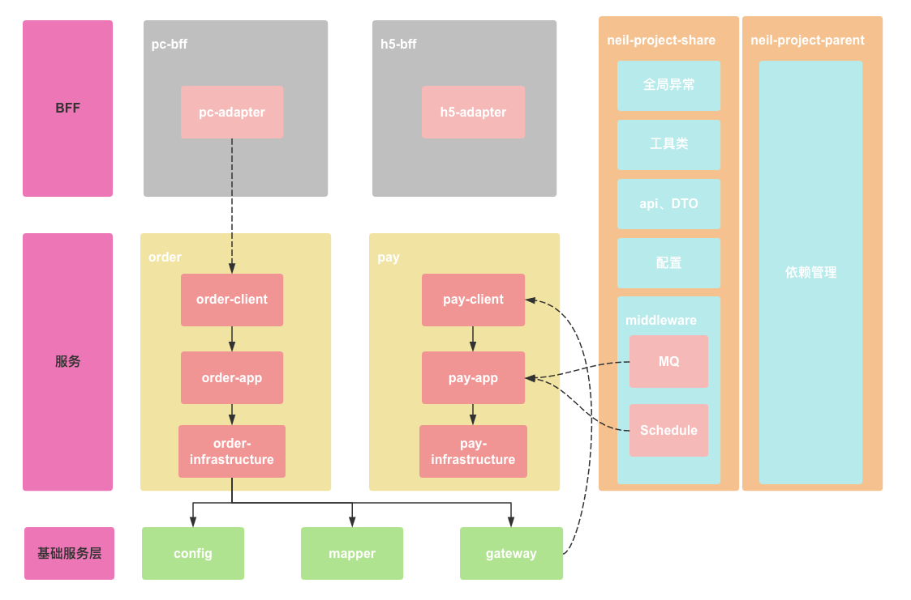

# neil-project-framework

## 应用架构



### neil-project-dependencies

**统一管理应用依赖（公用依赖需谨慎添加）**

使用标签 `<optional>true</optional>`可让自应用选择性添加对应依赖。

```xml
    <dependency>
      <groupId>XX.XXX.XXX</groupId>
      <artifactId>XX-XX-XX-XX</artifactId>
      <optional>true</optional>
    </dependency>
```

### neil-project-share

**统一提供应用二方库**

包含：
1. 统一异常处理
2. 统一BaseResult、Constants
3. 工具类
4. 统一中间件配置
5. 统一api、DTO、枚举管理
6. ...

### neil-project-pc-bff（Backends For Frontends）

**服务于（PC）前端的后端**

这样的架构是将整个应用的**BFF**统一处理，当然也可以将每一个微服务构建一个**BFF**，例如：**order-bff**，**pay-bff**。

该应用包含两个模块：
1. pc-start：启动模块
2. pc-adapter：展示层模块，即**MVC**中的Controller，该模块调用微服务中的**client**模块。


### neil-project-order

**order服务**

该应用包含四个模块：
1. order-start：启动模块
2. order-client：对外api层
3. order-app：业务处理层，包含**service**、**schedule**、**message**
4. order-infra：基础设施层，包含**config**、**mapper**、**gateway**


